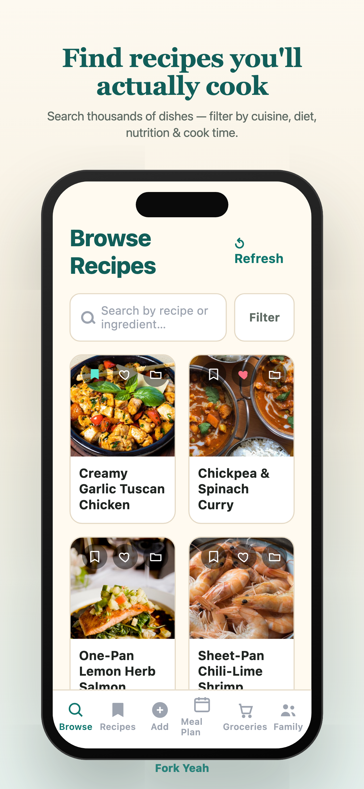
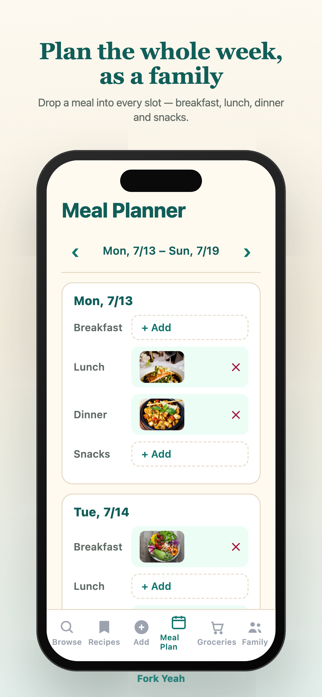
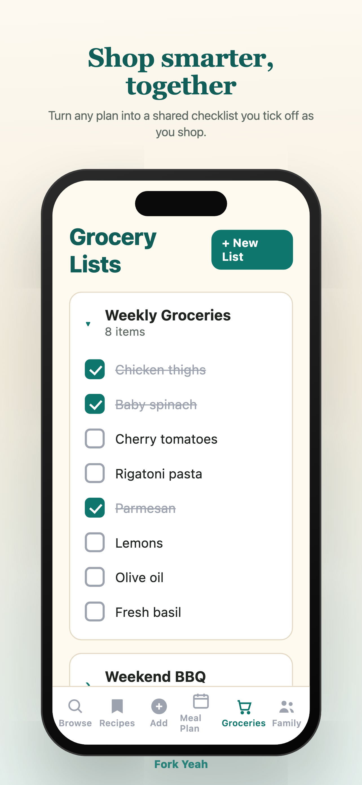

# Fork Yeah 🍴

**Recipes, meal planning & smart grocery lists — for the whole family.**

Fork Yeah turns *"what's for dinner?"* into the easiest question of your day. Discover recipes you'll actually cook, drop them onto a weekly plan, and turn any plan into a shared grocery list your whole household can check off together.

Built with [Expo](https://expo.dev) + React Native, backed by Firebase, with recipe data from [Spoonacular](https://spoonacular.com/food-api).

<p align="center">
  
  
  
</p>

---

## Features

- **Browse recipes** — Search thousands of dishes from Spoonacular and filter by cuisine, diet, meal type, nutrition, and cook time.
- **Save & organize** — Favorite recipes, mark what you want to try, and sort everything into your own folders.
- **Add your own recipes** — Capture family recipes with photos, ingredients, and steps.
- **Weekly meal planner** — Add any saved recipe to a breakfast, lunch, dinner, or snack slot on a clean weekly board.
- **Smart grocery lists** — Keep multiple lists, check items off as you shop, and swipe to delete.
- **Family sharing** — Invite family members by email; recipes, plans, and lists stay in sync for everyone.
- **Private & secure** — Email/password, Sign in with Apple, and Google sign-in, with an optional Face ID / biometric lock on the whole app.

## Tech stack

| Area | Choice |
|------|--------|
| Framework | [Expo](https://expo.dev) (React Native 0.86, React 19) |
| Navigation | [Expo Router](https://docs.expo.dev/router/introduction/) (file-based) |
| Auth & data | [Firebase](https://firebase.google.com) Auth + Cloud Firestore |
| Server state | [TanStack Query](https://tanstack.com/query) |
| Forms | [React Hook Form](https://react-hook-form.com) |
| Recipe data | [Spoonacular API](https://spoonacular.com/food-api) |
| Native auth | Apple / Google sign-in, `expo-local-authentication` (Face ID) |

## Getting started

### Prerequisites

- **Node.js** 18+ and npm
- **Xcode** (for iOS) and/or **Android Studio** (for Android)
- A [Spoonacular API key](https://spoonacular.com/food-api) (free tier works)

> **Note:** This app uses native modules (Apple Sign-In, biometrics, dev client), so it runs on a **development build** — not Expo Go.

### 1. Install dependencies

```bash
npm install
```

### 2. Configure environment

Create a `.env` file in the project root:

```bash
EXPO_PUBLIC_SPOONACULAR_API_KEY=your_spoonacular_key_here
```

The Firebase client config lives in [`lib/firebase.ts`](lib/firebase.ts) (public web config — safe to ship; real access is enforced by Firestore security rules).

### 3. Run the app

```bash
npm run ios       # build & launch on the iOS simulator
npm run android   # build & launch on an Android emulator/device
npm run start     # start the Metro dev server (for an existing dev build)
```

## Project structure

```
app/                      # Expo Router routes
  (auth)/                 # login, signup, forgot-password
  (app)/(tabs)/           # Browse · Recipes · Add · Meal Plan · Groceries · Family
  (app)/recipe/[id]       # Spoonacular recipe detail
  (app)/my-recipe/[id]    # user-authored recipe detail
components/               # reusable UI (RecipeCard, GroceryListCard, …)
contexts/AuthContext.tsx  # auth state, family data, folders
hooks/                    # data + editor hooks (useBrowseRecipes, useGroceryItemsEditor, …)
lib/                      # firebase.ts, familyData.ts, biometric.ts
store-assets/             # App Store screenshots
```

## Scripts

| Command | Description |
|---------|-------------|
| `npm run start` | Start the Metro dev server |
| `npm run ios` | Build and run on iOS |
| `npm run android` | Build and run on Android |
| `npm run web` | Run in the browser |

---

*Fork Yeah — cook more, waste less.* 🍴
